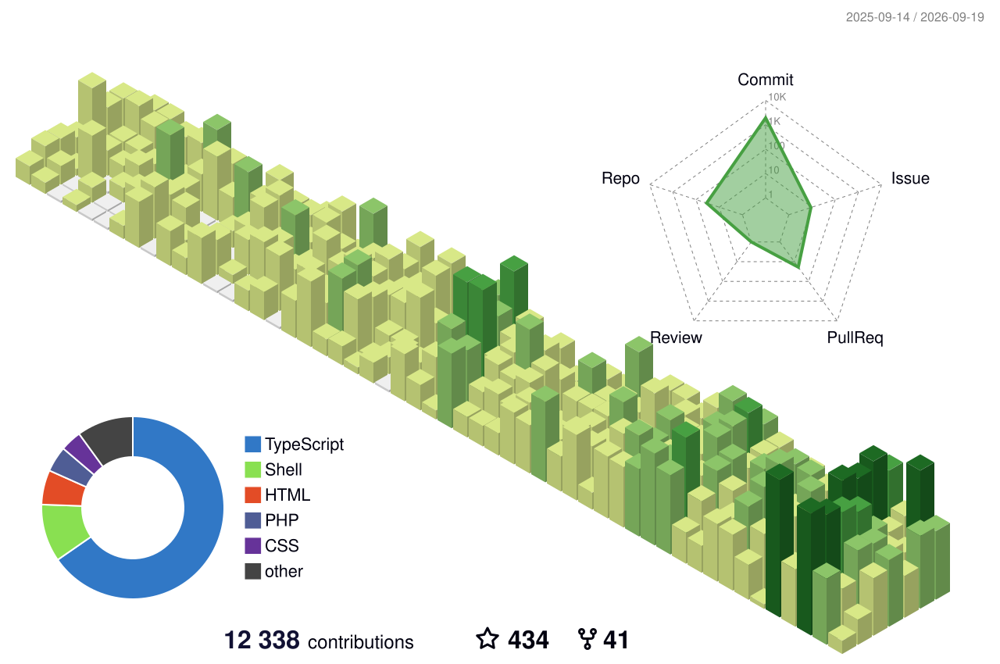

# Hi, I'm Navid 👋

🛰️ **Forward Deployed Engineer & Technical Manager**

> **Nine years of building backends.**
> *Now leading the team that ships them.*

---

## 🚀 About Me

I lead the team behind **SAFEJETS** — quality and safety management products used by
business-aviation operators. In this domain a bug isn't a bug, it's a compliance finding,
and that changes how you build.

Before that I **founded my own company in 2019** and ran it as CTO for three years, shipping
two cryptocurrency-exchange products. After military service and a move to Türkiye, I started
again as an engineer and was leading the team within a year.

I work **forward-deployed**: sitting close to the operators who actually use what we build,
shipping against their live workflows instead of a spec written three months earlier.

I care about:
- architecture that survives growth
- code that explains itself
- systems that don't panic under load

---

## 🌱 Current Focus

- Running delivery and architecture for a safety-critical aviation platform
- Setting the conventions for **AI-assisted development** on code where a model can't be left
  to freewheel through compliance logic
- Building **DINALABS** — internal tooling, on the side
- Shipping my own iOS apps: **AutoMetric** and **HeartChat AI**
- Learning Kubernetes and Terraform, properly rather than superficially

---

## 📊 GitHub Activity

---

## 🧠 Philosophy

> Strong foundations beat clever hacks.
> Simple systems last longer.
> Shipping beats polishing forever.

---

## 📬 Connect

