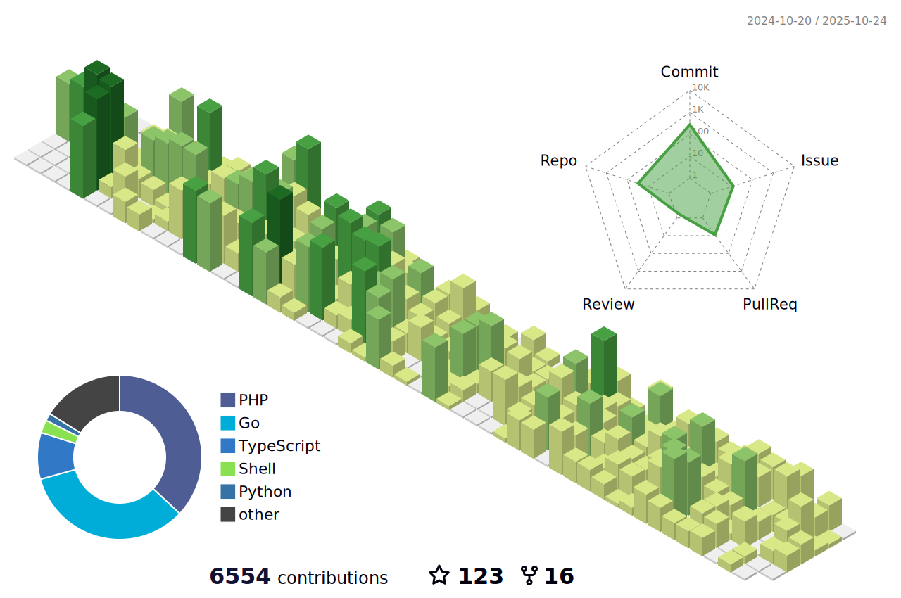

# Hello, I'm Navid 👋  
  
  
  
  

---

## 🚀 About Me  

I’m **Navid Mirzaaghazadeh**, a **Full Stack Tech Builder** 

Over the past **8+ years**, I’ve delivered **50+ projects** across different industries — helping businesses grow with **clean, modular, and scalable technology**.  

---

## 🌱 Currently Exploring

* Contributing to **open-source projects** with a focus on APIs, tooling, and developer experience
* Building **Laravel libraries** to speed up development and enforce clean architecture

---

📫 Reach me via the badges above, or visit [Navid.tr](https://navid.tr).  

---

## 📊 Github Stats  

